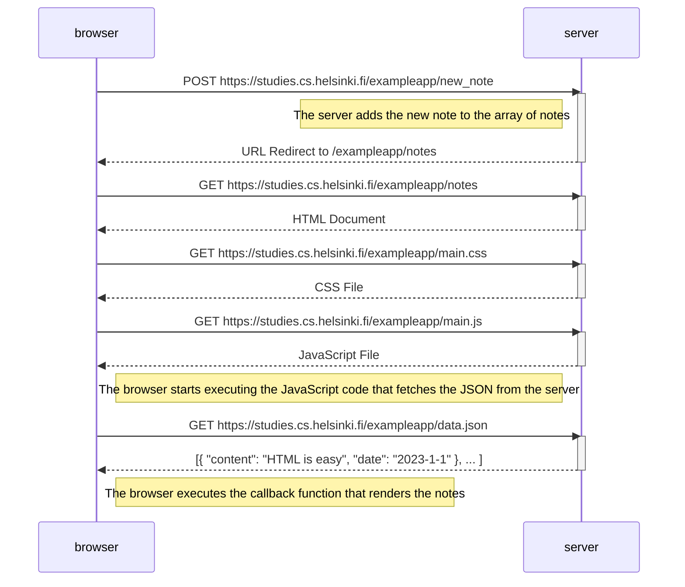

```mermaid
sequenceDiagram;
  participant bw as browser;
  participant sv as server;

  bw->>sv: POST https://studies.cs.helsinki.fi/exampleapp/new_note;
  activate sv;
  note left of sv: The server adds the new note to the array of notes;
  sv-->>bw: URL Redirect to /exampleapp/notes;
  deactivate sv;

  bw->>sv: GET https://studies.cs.helsinki.fi/exampleapp/notes;
  activate sv;
  sv-->>bw: HTML Document;
  deactivate sv;

  bw->>sv: GET https://studies.cs.helsinki.fi/exampleapp/main.css;
  activate sv;
  sv-->>bw: CSS File;
  deactivate sv;

  bw->>sv: GET https://studies.cs.helsinki.fi/exampleapp/main.js;
  activate sv;
  sv-->>bw: JavaScript File;
  deactivate sv;
  Note right of bw: The browser starts executing the JavaScript code that fetches the JSON from the server;

  bw->>sv: GET https://studies.cs.helsinki.fi/exampleapp/data.json;
  activate sv;
  sv-->>bw: [{ "content": "HTML is easy", "date": "2023-1-1" }, ... ];
  deactivate sv;
  Note right of bw: The browser executes the callback function that renders the notes;
```
